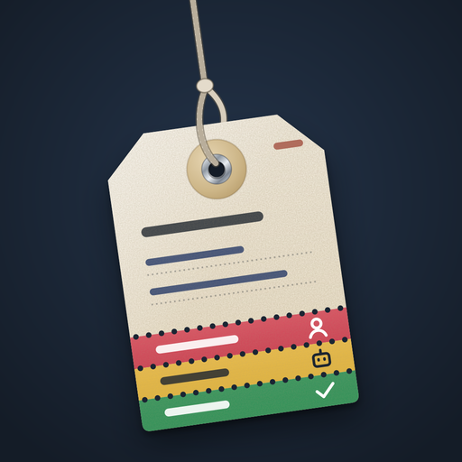
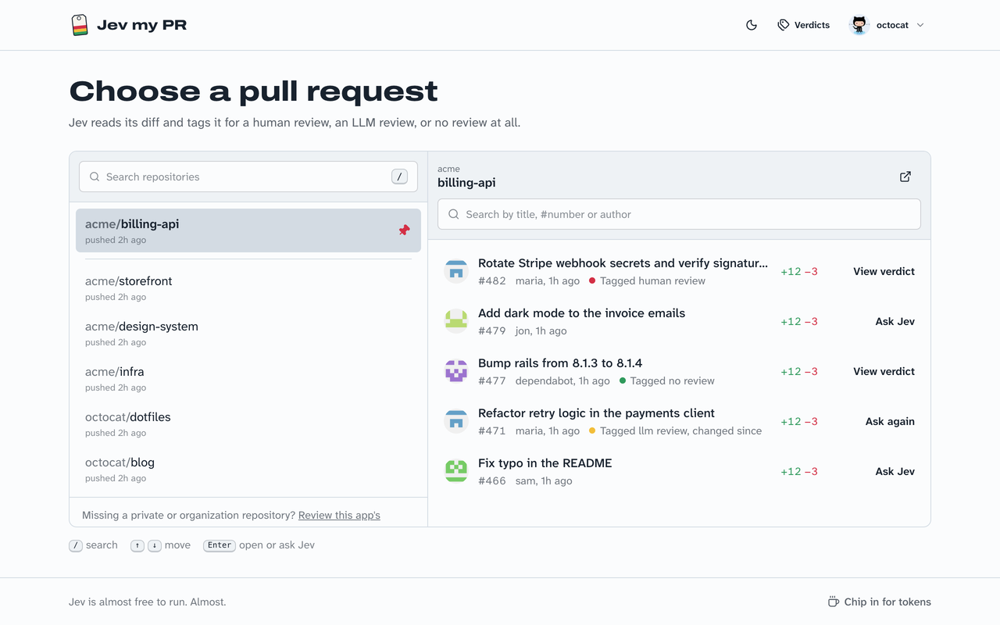
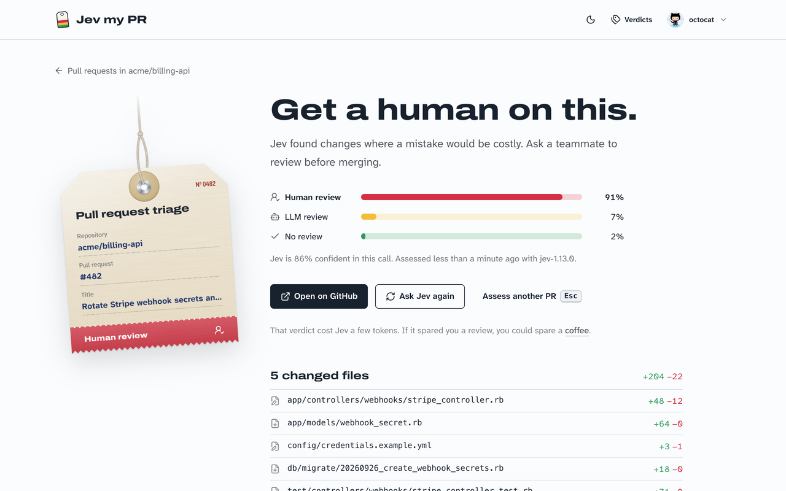
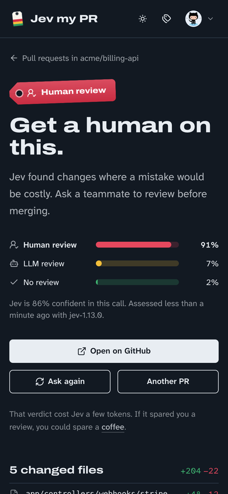

<p align="center">
  
</p>

<h1 align="center">Jev my PR</h1>

<p align="center"><strong>Does this pull request need a human?</strong><br>
Pick a PR from your GitHub repositories and Jev reads the diff and tags it:<br>
<em>human review</em>, <em>an LLM review is enough</em>, or <em>no review needed</em>.</p>

<p align="center"><strong><a href="https://jevmypr.romerramos.me">Try it at jevmypr.romerramos.me</a></strong> · free, sign in with GitHub</p>

<p align="center">
  
</p>

## How it works

1. **Sign in with GitHub** and pick one of your repositories (pin the ones you use most).
2. **Pick an open pull request.** Jev my PR sends its title, description, file list and diff to
   [Jev](https://typesafe.ai), a small classification model, with one question:
   *does this PR need a review from a human?*
3. **Read the verdict.** Jev answers with one of three options and how sure it is:

| Verdict | Meaning |
|---|---|
| 🟥 **Human review** | Risky or complex changes (security, auth, payments, data migrations, architecture). A teammate should review. |
| 🟨 **LLM review** | Real but low-risk changes (small features, refactors, tests). An automated LLM review should catch what matters. |
| 🟩 **No review** | Trivial changes (typos, docs, formatting, version bumps). |

Verdicts are saved. Opening a pull request that hasn't changed since its last verdict shows the saved one for
free; you can always ask Jev again.

On the verdict page, **Check every file** asks the same question for each changed file, with the PR title and
description as context. Results appear beside each file and are saved. Each file verdict counts toward your
weekly limit. You can resume unfinished checks; files with missing or oversized patches stay unassessed.
If the PR changes, ask for a fresh PR verdict before checking its files.

<p align="center">
  
</p>

<p align="center">
  
</p>

## Your data

Jev my PR only uses your data to answer the question above.

- **GitHub:** it asks for the `read:user` and `repo` scopes. `repo` is the only way GitHub offers to read private
  repositories; the app only ever *reads* (repositories, pull requests, files and diffs) and never writes.
- **Sent to Jev (typesafe.ai):** for the pull request you pick: repository name, title, description (first
  5,000 characters), author login, branch names, line counts, file list and the diff (first 100 KB). For file
  checks, it sends the repository, PR title and description, file metadata and that file's patch.
- **Stored:** your GitHub id, login, name, avatar URL and account creation date; your GitHub token, **encrypted**
  with Active Record encryption; sign-in sessions (IP address and browser); your verdicts (PR title, URL, file list,
  result and token counts, including per-file verdicts), pinned repositories, and which pull requests were too big
  for Jev to read.
- **Not done:** no analytics, no trackers, no third-party scripts or fonts, nothing sold or shared. The only other
  thing your browser loads is GitHub avatars, from GitHub.
- **Delete it:** *account menu → Delete my data* removes your account, token, verdicts, pins and too-big marks. You can also
  revoke the app under GitHub → Settings → Applications.

## Fair use limits

Jev my PR is free and runs on a small monthly budget, so there are limits (see
[`app/models/jev_allowance.rb`](app/models/jev_allowance.rb)):

- **30 verdicts per user per week** (about 6 per workday). PR and file verdicts share this limit. Re-reading
  saved verdicts and reopening pull requests that haven't changed since their verdict is free.
- **5 requests per minute** per user.
- GitHub accounts **younger than 30 days** can look around but can't ask Jev (keeps bots out).
- New verdicts **pause for everyone** once the month's estimated Jev spend reaches the budget, until the 1st.

## Run it yourself

You need Ruby (see [`.ruby-version`](.ruby-version)), SQLite, a GitHub account and a
[TypeSafe](https://typesafe.ai) API key.

1. **Create a GitHub OAuth App** at [github.com/settings/developers](https://github.com/settings/developers)
   (an *OAuth App*, not a *GitHub App*) with the callback URL `http://localhost:3000/auth/github/callback`.
   Suggested name, description and logo are in [`design/github`](design/github/README.md).
2. **Add your secrets** with `bin/rails credentials:edit`, following
   [`config/credentials.example.yml`](config/credentials.example.yml). Generate the encryption keys with
   `bin/rails db:encryption:init`. Environment variables work too:

   | Credential | Environment variable |
   |---|---|
   | `github.client_id` | `GITHUB_CLIENT_ID` |
   | `github.client_secret` | `GITHUB_CLIENT_SECRET` |
   | `typesafe.api_key` | `TYPESAFE_API_KEY` |
   | `active_record_encryption.primary_key` | `ACTIVE_RECORD_ENCRYPTION_PRIMARY_KEY` |
   | `active_record_encryption.deterministic_key` | `ACTIVE_RECORD_ENCRYPTION_DETERMINISTIC_KEY` |
   | `active_record_encryption.key_derivation_salt` | `ACTIVE_RECORD_ENCRYPTION_KEY_DERIVATION_SALT` |

3. **Start it:**

   ```sh
   bin/setup   # installs gems, prepares the database and starts the app on http://localhost:3000
   bin/dev     # later runs
   ```

### Tests

```sh
bin/rails test          # models, controllers, adapters (GitHub and Jev calls are stubbed)
bin/rails test:system   # the full flow in headless Chrome
bin/rubocop && bin/brakeman
```

### Deploying

It's a standard Rails 8 app with a `Dockerfile` and a [Kamal](https://kamal-deploy.org) config in
`config/deploy.yml`. In production, set `SECRET_KEY_BASE` and the variables above (or `RAILS_MASTER_KEY` with your
own credentials), and use a cache store for rate limiting (the Rails 8 default, Solid Cache, works).

## Releases

Releases follow [semantic versioning](https://semver.org): the current version is in [`VERSION`](VERSION), shown
next to the logo, and each release is a `vX.Y.Z` tag with notes on the
[releases page](https://github.com/romerramos/jevmypr/releases). `bin/release` cuts one and `bin/update` moves a
server checkout to a release; [AGENTS.md](AGENTS.md) describes both, for people and coding agents.

## Built with

Rails 8, Hotwire (Turbo and Stimulus), SQLite, Tailwind CSS 4 with [daisyUI](https://daisyui.com),
[Lucide](https://lucide.dev) icons, [Pagy](https://ddnexus.github.io/pagy/) and OmniAuth. Fonts:
[Archivo](https://github.com/Omnibus-Type/Archivo) and
[Atkinson Hyperlegible Next](https://github.com/googlefonts/atkinson-hyperlegible-next), self-hosted.

## Contributing

Issues and pull requests are welcome. Please run the tests, RuboCop and Brakeman before opening a PR;
[AGENTS.md](AGENTS.md) has the project conventions.
To report a security problem, see [SECURITY.md](SECURITY.md).

## Support

Jev is almost free to run. Almost. If Jev my PR spared you a review or two, you can
[chip in for tokens](https://buymeacoffee.com/romerramos). ☕

## License

[MIT](LICENSE) © Romer Ramos. The bundled fonts are under the SIL Open Font License
(see [`app/assets/fonts`](app/assets/fonts)); daisyUI is MIT.
